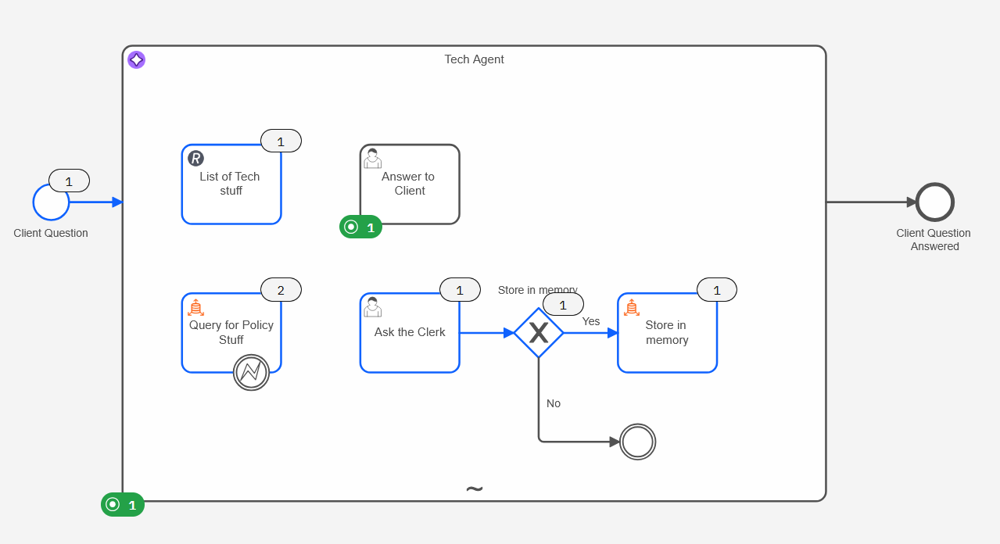
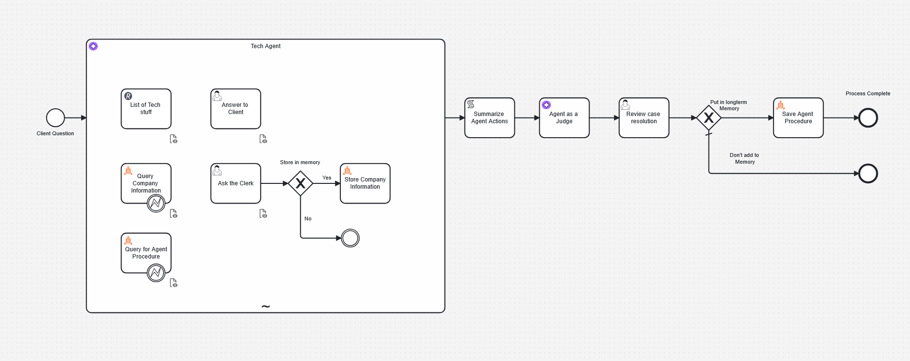

# Long Term Memory Agent Example



This BPMN process model demonstrates how to build an AI-powered agent with long-term memory capabilities using Camunda. The agent is designed to answer client questions about tech products, learn from human interactions, and improve its knowledge over time.

## Process Overview

The process flow is as follows:

1.  **Initiation**: The process begins when a client submits a question through a start form.
2.  **AI Agent Activation**: The question is passed to a central "Tech Agent," an AI-powered Ad-Hoc Sub-Process. This agent uses an LLM (configured for AWS Bedrock with Claude Sonnet) to understand the request and decide on the next best action.
3.  **Tool Execution**: The agent has access to a set of tools to find an answer:
    *   **List of Tech stuff**: A Service Task that calls an external API to get a list of available tech products.
    *   **Query Company Information**: A Service Task that queries a vector database (Amazon OpenSearch) to find relevant company/product information from its knowledge base.
    *   **Query for Agent Procedure**: A Service Task that queries a second vector database index containing past agent executions — allowing the agent to learn from how similar requests were handled before. See [Bonus: Learning from Past Agent Executions](#bonus-advanced-use-case-learning-from-past-agent-executions) for details.
    *   **Ask the Clerk**: A User Task that assigns a task to a human clerk if the agent cannot find the answer on its own.
    *   **Answer to Client**: A User Task used by the agent to communicate its findings back to the client.
4.  **Learning Loop (Long-Term Memory)**: If the agent consults a human clerk, the process can store the clerk's answer. A gateway checks if the answer should be saved. If so, the "Store Company Information" task embeds the new information and adds it to the vector database, making it available for future queries.
5.  **Post-Process Evaluation & Institutional Memory**: After the agent completes its work, the process continues into an advanced evaluation and memory-storage pipeline. See [Bonus: Learning from Past Agent Executions](#bonus-advanced-use-case-learning-from-past-agent-executions).
6.  **Completion**: The process ends once the agent's execution has been evaluated and optionally stored.

## Key Components

*   **Start Event (Client Question)**: Captures the initial question from the user via a Camunda Form.
*   **Tech Agent (Ad-Hoc Sub-Process)**: The core of the process, containing the AI logic and the tools it can use. It orchestrates the entire question-answering flow.
*   **Service Task (Query Company Information)**: Searches the `tech-stuff-knowagebase` index in Amazon OpenSearch for company and product answers. Includes an error boundary event to handle cases where the knowledge index is not found.
*   **Service Task (Query for Agent Procedure)**: Searches the `techAgent-past-execution-knowagebase` index for past successful agent executions relevant to the current request. Also includes an error boundary event for missing indexes.
*   **User Task (Ask the Clerk)**: A human-in-the-loop task for escalating complex questions.
*   **Service Task (Store Company Information)**: Updates the knowledge base vector index with new information learned from the human clerk.
*   **Script Task (Summarize Agent Actions)**: Extracts the agent's reasoning and full conversation after the sub-process completes, using a FEEL expression.
*   **Service Task (Agent as a Judge)**: A second AI agent that evaluates the first agent's performance across multiple criteria.
*   **User Task (Review Case Resolution)**: A human reviews the AI judge's evaluation and decides whether to store the agent's procedure in long-term memory.
*   **Service Task (Save Agent Procedure)**: Embeds the agent's chain of thought into the `techAgent-past-execution-knowagebase` index, making it available to future agents.

## Setup & Configuration

To run this process, you will need to configure the following:

*   **Camunda Connectors**:
    *   AI Agent Job Worker (`io.camunda.agenticai:aiagent-job-worker:1`)
    *   AI Agent (`io.camunda.agenticai:aiagent:1`)
    *   HTTP JSON Connector (`io.camunda:http-json:1`)
    *   Embeddings Vector DB Connector (`io.camunda:embeddings-vector-database:1`)
*   **Secrets**: The process relies on secrets for connecting to AWS services (Bedrock, OpenSearch). These must be configured in your Camunda environment:

    | Secret | Description |
    |---|---|
    | `AWS_ACCESS_KEY` | AWS access key for Bedrock and OpenSearch |
    | `AWS_SECRET_KEY` | AWS secret key for Bedrock and OpenSearch |
    | `AWS_REGION` | AWS region (e.g. `us-east-1`) |
    | `AWS_VECTOR_ACCESS` | AWS access key specifically for the OpenSearch vector store |
    | `AWS_VECTOR_SECRET` | AWS secret key specifically for the OpenSearch vector store |
    | `AWS_LONGTERM_MEM` | The server URL of your Amazon Managed OpenSearch instance |

*   **Vector DB Indexes**: Two separate indexes must exist (or will be created) in your OpenSearch instance:
    *   `tech-stuff-knowagebase` — stores company/product knowledge
    *   `techAgent-past-execution-knowagebase` — stores past agent execution procedures
*   **Forms**: The associated Camunda Forms for the start event and user tasks must be deployed.

---

## Bonus Advanced Use Case: Learning from Past Agent Executions



This process includes an advanced pattern where the agent learns not just from human-provided knowledge, but from its **own past executions**. After every run, the agent's reasoning is evaluated, and high-quality executions are stored in a dedicated vector database index. Future agents can then query this index as a tool, effectively giving the agent access to institutional memory about *how* to solve problems — not just *what* the answers are.

### How It Works

#### Step 1 – Extract the Agent's Reasoning (Script Task: "Summarize Agent Actions")

Once the Tech Agent sub-process completes, a Script Task uses a FEEL expression to extract the agent's internal chain of thought and the full conversation from the process variable `agent`:

```feel
={
  "chainOfThought" : string join(
    flatten(agent.context.conversation.messages[role="assistant"].content).text,
    "\n---\n"
  ),
  "fullConversation" : agent.context.conversation
}
```

- `agent.context.conversation.messages` — accesses the full message history held in the agent's context.
- `[role="assistant"]` — filters to only the assistant's messages (the agent's own reasoning and responses).
- `.content` — extracts the content blocks from each message.
- `flatten(...)` — flattens the nested list of content blocks into a single list.
- `.text` — extracts just the text from each content block.
- `string join(..., "\n---\n")` — joins all the reasoning steps into a single string, separated by dividers.

The result is stored in the process variable `agentExectionDetails`, which contains both `chainOfThought` (a readable string) and `fullConversation` (the structured message list).

#### Step 2 – Evaluate the Agent's Performance ("Agent as a Judge")

A second, independent AI agent (`Agent as a Judge`) receives the `agentExectionDetails` as its user prompt and evaluates the execution against these criteria:

- **Domain-Scope Compliance** — Did the agent stay within its expected scope?
- **Tool-Usage Effectiveness** — Was each tool used appropriately and efficiently?
- **Chain-of-Thought Quality** — Was the reasoning coherent and well-structured?
- **Satisfaction Confirmation & Resolution** — Was the client's question fully resolved?
- **Regulatory & Privacy Compliance** — Did the agent respect relevant constraints?

The judge outputs a markdown-formatted summary stored in `llmjudge.complete_summary`.

**Configuration** (from the BPMN):
- Connector type: `io.camunda.agenticai:aiagent:1`
- Model: `us.anthropic.claude-sonnet-4-5-20250929-v1:0` (via AWS Bedrock)
- Result variable: `llmjudge`
- Result expression:
  ```feel
  ={"complete_summary" : responseText}
  ```

#### Step 3 – Human Review ("Review Case Resolution")

A human operator reviews the judge's summary via a User Task form. The form captures a boolean variable `storeInMemory`, which controls whether the agent's procedure will be stored for future use.

#### Step 4 – Conditional Storage (Exclusive Gateway)

The gateway checks `storeInMemory`:

- `=storeInMemory` (condition on the "Put in longterm Memory" path) → proceeds to **Save Agent Procedure**
- Default path → **End Event** (no storage)

#### Step 5 – Save the Agent's Procedure ("Save Agent Procedure")

If approved, the agent's chain of thought is embedded and stored in the `techAgent-past-execution-knowagebase` OpenSearch index:

**Key configuration** (from the BPMN):
| Parameter | Value |
|---|---|
| Operation type | `embedDocumentOperation` |
| Document source | `PlainText` |
| Document source variable | `=agentChainOfThough.chainOfThought` |
| Index name | `techAgent-past-execution-knowagebase` |
| Embedding model | `TitanEmbedTextV2` (AWS Bedrock) |
| Embedding dimensions | `D1024` |
| Document splitter | `recursiveDocumentSplitter` |
| Max segment size | 500 characters |
| Max overlap size | 80 characters |

> Note: The document source variable uses `agentChainOfThough.chainOfThought` (mapped from the `agentExectionDetails` output of the script task).

#### Step 6 – Querying Past Executions on Future Runs ("Query for Agent Procedure" tool)

Inside the Tech Agent sub-process, the agent has access to a tool called **"Query for Agent Procedure"**. The agent's description for this tool is:

> *"Use this tool to search the knowledge base for information on how this kind of request was solved in the past to ensure your solution learns from past successes."*

The query to the vector database is generated dynamically by the AI using a FEEL `fromAi()` expression:

```feel
=fromAi(toolCall.query, "The knowledge base query you want to perform")
```

`fromAi()` is a Camunda FEEL function that tells the AI Agent connector to let the LLM supply the value at runtime. The second argument is the description passed to the LLM so it knows what kind of value to generate. This means the agent formulates its own search query based on the user's question, then searches the index for similar past cases.

**Key configuration** (from the BPMN):
| Parameter | Value |
|---|---|
| Operation type | `retrieveDocumentOperation` |
| Query | `=fromAi(toolCall.query, "The knowledge base query you want to perform")` |
| Document limit | `5` |
| Index name | `techAgent-past-execution-knowagebase` |
| Error handling | Boundary error event catches `index_not_found` and returns `{"QueryResult": "No Data found for this query"}` |

### Summary of the Two Vector DB Indexes

| Index | Purpose | Written by | Read by |
|---|---|---|---|
| `tech-stuff-knowagebase` | Company/product knowledge | "Store Company Information" (clerk answers) | "Query Company Information" tool |
| `techAgent-past-execution-knowagebase` | Past agent execution procedures | "Save Agent Procedure" (post-process) | "Query for Agent Procedure" tool |

This separation means the agent has two distinct sources of knowledge: factual company information and procedural memory about how to handle different types of requests.